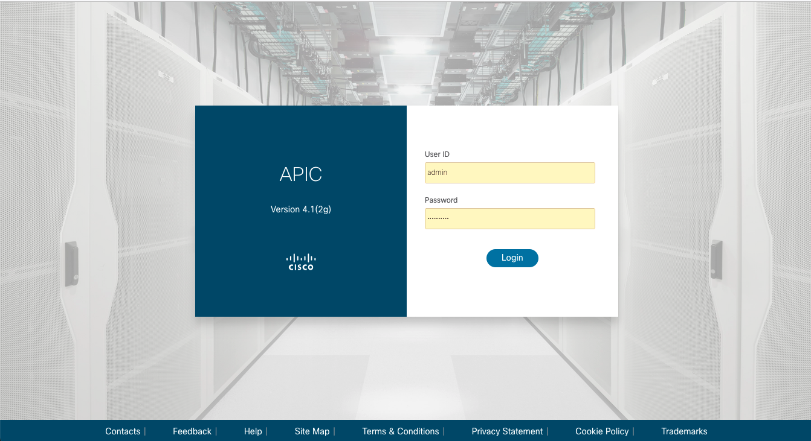

# Lab0

## dCloud 접속 가이드
- [VSCode_dCloud_접속가이드_202110.pdf](./VSCode_dCloud_접속가이드_202110.pdf) 참고

<br>

## Ansible Control VM
- Ansible 버전 업그레이드
```
VERSION_ANSIBLE=2.9.13 
VERSION_ANSIBLE_ACI=2.0.0 

yes | pip uninstall ansible
pip install ansible==${VERSION_ANSIBLE}

ansible-galaxy collection install cisco.aci:==${VERSION_ANSIBLE_ACI} 

pip install openpyxl pandas paramiko
```

- 버전 확인
```
# ansible --version
ansible 2.9.13
  config file = /etc/ansible/ansible.cfg
  configured module search path = [u'/root/.ansible/plugins/modules', u'/usr/share/ansible/plugins/modules']
  ansible python module location = /usr/lib/python2.7/site-packages/ansible
  executable location = /usr/bin/ansible
  python version = 2.7.5 (default, Apr  9 2019, 14:30:50) [GCC 4.8.5 20150623 (Red Hat 4.8.5-36)]
```
- Lab 소스 다운로드
```
git clone https://github.com/insobi/aci_ansible_hol.git
cd aci_ansible_hol
ls -l
```

<br>

## dCloud ACI 접속

- https://198.18.133.200
- User ID: admin
- Password: C1sco12345