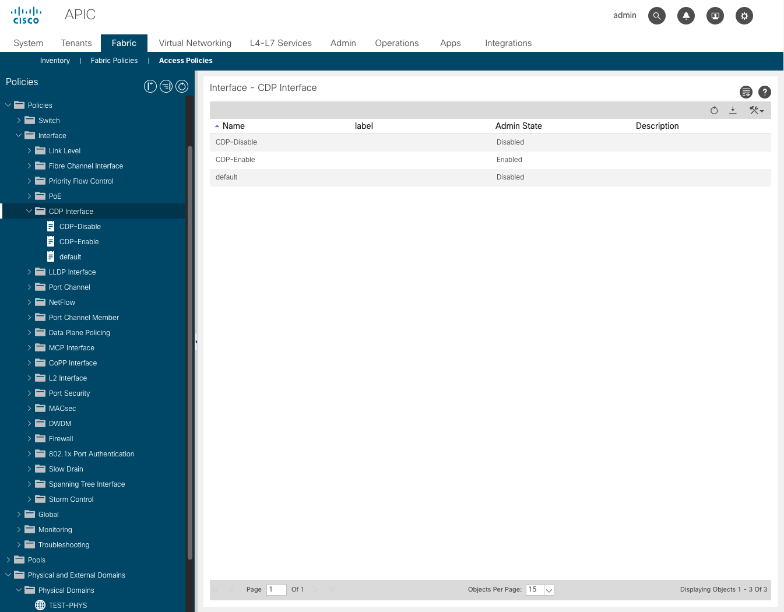

# Lab2



- Physical Domain
- Policies
- AEP

## Exercise 1
- anchor와 alias를 이용하여 task 마다 중복되는 코드 수를 줄임 (login 관련 parameters)
```
ansible-playbook playbook1.yml
```

## Exercise 2
- Inventory에 ACI 로그인 관련 parameter를 추가
- ACI 로그인 관련 parameter의 하드코딩을 변수값으로 수정
```
ansible-playbook playbook2.yml
```

## Exercise 3
- 새로운 task를 추가
  - Physical Domain
  - CDP Policy
  - AEP
  - Binding Domain to AEP
```
ansible-playbook playbook3.yml
```