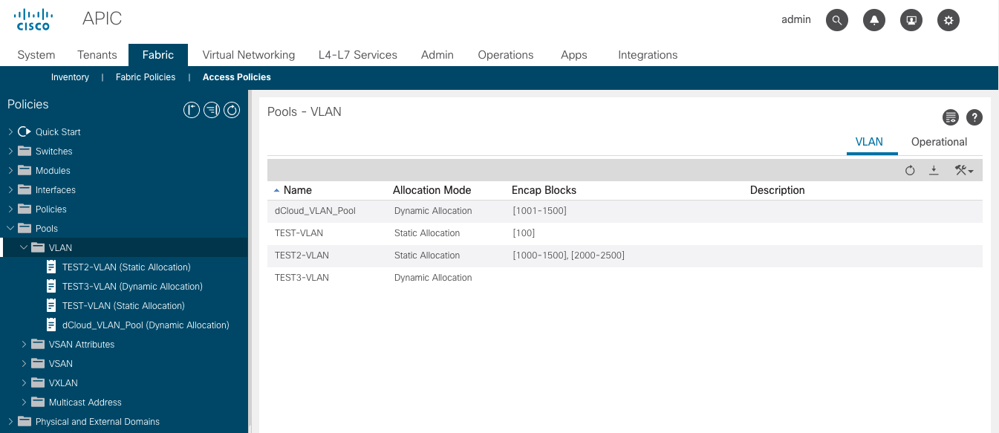

# Lab1



- vlan_pools

<br>

## Exercise 1
- connection: local 사용
- https://docs.ansible.com/ansible/latest/collections/cisco/aci/aci_vlan_pool_module.html
```
ansible-playbook playbook1.yml
```

<br>

## Exercise 2
- Play에 variable 추가
```
ansible-playbook playbook2.yml
```

<br>

## Exercise 3
- 새로운 task를 추가
```
ansible-playbook playbook3.yml
```

<br>

## Exercise 4
- vlan pool의 이름을 배열로 갖는 vlan_pools 변수를 추가
- 2개의 task를 1개로 줄이고, task에 loop를 추가하여 vlan_pools 변수를 이용
```
ansible-playbook playbook4.yml
```

<br>

## Exercise 5
- vlan_pools 변수를 수정 (name, mode)
```
ansible-playbook playbook5.yml
```
<br>

## Exercise 6
- VLAN Encap Block 관련 task와 variable을 추가
- https://docs.ansible.com/ansible/latest/collections/cisco/aci/aci_vlan_pool_encap_block_module.html
```
ansible-playbook playbook6.yml
```
