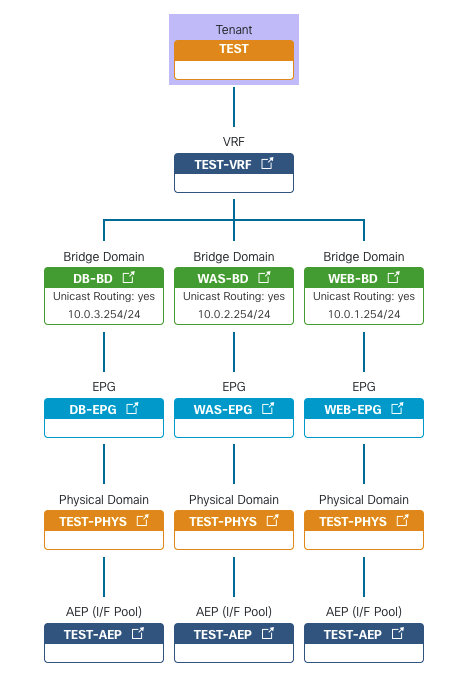

# Lab4



- Tenant
- VRF
- Bridge Domain
- Application Profile
- EPG

<br>

## Exercise 1
- Tenant 생성
- VRF 생성
- Bridge Domain 생성
```
ansible-playbook playbook1.yml
```

<br>

## Exercise 2
- Application Profile 생성
- EPG 생성
- EPG를 Domain에 연결
```
ansible-playbook playbook2.yml
```