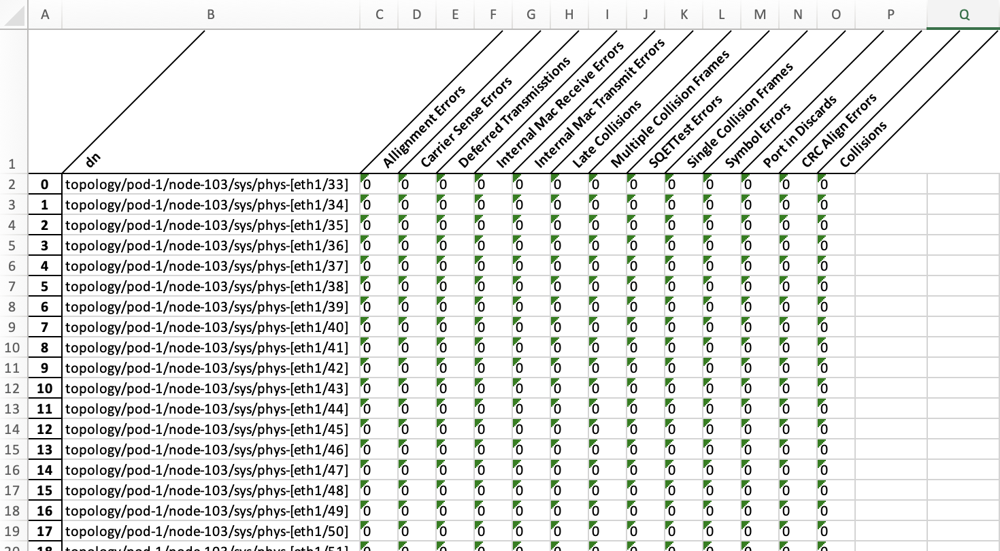

# Lab5


- REST API를 이용한 데이터 수집 및 가공 예시

<br>

## Exercise 1
- Physical Interface 상태 수집
```
ansible-playbook playbook1.yml
```

<br>

## Exercise 2
- Physical Interface 모니터 정보 수집
```
ansible-playbook playbook2.yml
```

<br>

## Exercise 3
- Fault 정보 수집
- Health Score 수집
- Webex 메시지 전송
```
ansible-playbook playbook3.yml
```